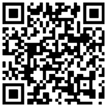

Friends of Robot Casserole is a tax exempt non-for profit corporation (501c3) in the state of Illinois. 

Friends of Robot Casserole's mission is to act as a charitable booster organization for FRC team 1736 Robot Casserole; in order to fundraise and accept donations from sponsors and fund the mission of the FIRST Robotics Competition Team 1736 Robot Casserole and their mission of STEM education as outlined by FIRST (For Inspiration and Recognition in Science and Technology).

Federal EIN: 92-3834452

 

# Donations

Supporting Friends of Robot Casserole is easy! All donations are tax deductible.

<h1><a href="https://www.paypal.com/donate/?hosted_button_id=65P57LZY5G7EW"  target="_blank" rel="noopener noreferrer">Click here or scan the QR code to donate now!</a></h1>

 

# Board of Directors

| Position |  Name | 
| -------- | ----- |
| President | Chris Gerth |
| Secretary | Dawn Gersich |
| Treasurer | Larry Schmidt |
| At Large | Tim Wong |
| At Large | Jim Holeman |

 

Last Updated 27-Jan-2024

